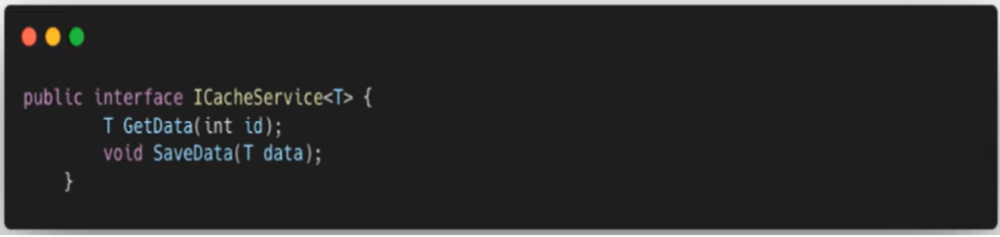

Curso Formação Arquitetura de Software no nextwave(LuisDEV)

### O que é Arquitetura de Software
 - De maneira simples, arquitetura no contexto de software se refere a construir um sistema para um cliente
 - Também é descrita como composição, integração e interação de componentes em um sistema
 - Desse ponto de vista, todo sistema tem uma arquitetura de software. Porem, é de entendimento comum que existem arquiteturas boas e arquiteturas não tão boas.
 - Algo que será discutido mais para frente no curso é sobre as consequências de uma má arquitetura de software, como:
   - Dificuldade em se entender
   - Dificuldade em se modificar
 - Isso resulta em entregas mais lentas e com maior índice de defeitos
 - Por outro lado, uma boa arquitetura resulta em sistemas mais fáceis de entender, com código e estrutura legíveis e de melhor manutenção, resultando em entregas mais rápidas    e com menos bugs
 - Definição de arquitetura a partir de norma
   - Existia a norma 1471 ANSI/IEEE que define Arquitetura de Software desde setembro de 2000
     - Recommended practice for architectural description of software-intensive systems
   - Foi substituído pela norma ISO/IEC 42010
     - Mais detalhes sobre ela em https://www.iso.org/standard/74393.html
   - Embora a maior parte dos programadores realmente não ligam para essas normas, existem muitas informações interessantes nela aplicáveis em nossos projetos

### Arquitetura: Construção x Software: faz sentido comparar?
 - Pelo termo similar, é comum associarmos Arquitetura de Software a Arquitetura relacionada a construção civil
 - Uma diferença fundamental é a respeito ao processo de planejamento e execução de ambas arquiteturas
   - Na construção civil, existe um imenso trabalho de desenho da arquitetura ANTEs de sua execução, com planos muitos detalhados. Nela também os seus artefatos são caros e      complexos, dificultando muito uma mudança em tempo real no projeto aprovado.
 - Uma diferença fundamental é a respeito ao processo de planejamento e execução de ambas arquiteturas
   - Já no planejamento e desenvolvimento de Software, os requisitos são constantemente definidos e refinados (e até removidos), exigindo agilidade que não pode ser              comparada a arquitetura da construção civil

  ### Identificação de Requisitos
   - As funções de um sistema são definidas através de um conjunto de requisitos
   - Esses requisitos podem influenciar a arquitetura do sistema
   - Tipos de requisito
     - Requisitos funcionais
     - Requisitos não-funcionais
   - Requisitos Funcionais
     - Define uma ação necessária do sistema
     - Uma função é descrita através de entrada, comportamento, e saída
     - Geralmente falta uma descrição mais detalhada do comportamento esperado das funções de sistema
   - Requisitos Não-Funcionais
     - Define um atributo do sistema que foi explicitamente solicitado por algum dos stakeholdes
     - Alguns exemplos
       - Escalabilidade
       - Segurança
       - Acessibilidade

### Arquitetura de Software x Modelo Waterfall
 - Upfront Architecture (Arquitetura Adiantada/Antecipada)
   - Definição da arquitetura do sistema completa e definida antes de se iniciar o projeto
   - Programação nesse modelo é visto como a implementação das ideias definidas em instruções de software
 - Modelo Waterfall
   - Datado da década de 1970, define uma sequencia de fases para o desenvolvimento de software
   - Cada fase precisa estar complete antes de avançar para a próxima
   - São elas:
     - Definição de Requisitos
     - Desenho
     - Implementação
     - Verificação
     - Manutenção
   - Falha em se adaptar a dinâmica normal de criação de softwares
   - A maior parte dos projetos ultrapassam o orçamento e prazos, muitas vezes até entregando funcionalidades que não atendem os requisitos definidos
   - A realidade é diferente
     - Requisitos mudam muito rápido, muitas vezes sendo criados novos e até removidos alguns que se acreditar agregar valor no projeto
     - Por essa razão, o modelo Waterfall não atende aos cenários modernos de software por ignorar a dinâmica do desenvolvimento de software e focar excessivamente em             planejamento. 

### Arquitetura Emergente
 - Quanto antes o time começar a desenvolver, mais cedo vai conseguir feedback e melhorar a qualidade do software
 - É comum que em projetos de software se tenha arquitetura inicial, similar a outros projetos da empres, como um boilerplate
 - A arquitetura deve suportar alterações frequentes e entrega de valor acelerada
 - Arquitetura Emergente (ou Emerging Architecture) é o processo composto pela construção incremental do software.
 - Apos o início, o projeto passa por diversas iterações compostas por fases do desenvolvimento de software, como desenho, implementação e teste
 - Quando um projeto que utiliza metodologias ágeis é iniciado, apenas alguns requisitos são definidos, sendo refinados ou surgindo novos ao longo do projeto
 - No inicio de cada iteração ou sprint os requisitos a serem implementados são definidos, e no final uma entrega de software funcional é feita

### O que é Arquiteto de Software e Suas Responsabilidades
 - Profissional responsavel por unir os requisitos e as especificações do sistema
 - Responsavel pela arquitetura do sistema
 - Interage com analistas de negocio e gerentes de projeto, avaliando e recomendando opções de soluções para o projeto, além de coordenar um time de programadores
 - Principais Responsabilidades:
   - Identificação de requisitos
   - Divisão do sistema em componentes
     - O desenho da solução é influenciado pelo requisitos
   - Identificação e avaliação de tecnologias
     - O arquiteto deve conhecer os custos e beneficios associados a diferentes tecnologias e produtos, propondo o uso de algum(s) deles em cenários que sejam beneficios ao projeto.
   - Formular especificações
     - Forma de comunicar as decisões arquiteturais ao time de desenvolvimento
     - Alguns formatos comumente utilizados são os diagramas UML, documentos de word, Wikis e etc

### Mito sobre Arquiteto de Software
 - Um grande mito existente no mercado é que o Arquiteto de Software não deveria escrever codigo
 - Na minha opinião, arquitetos não deveriam estar em um patamar diferente dos programadores em equipes de desenvolvimento
 - São profissionais bons e experientes, que têm grande exposição a código, e que após a definição do desenho do sistema, trabalham juntos com os programadores para garantir a implementação adequada
 - Logo, arquitetos são programadores com amior experiência e formação
 - No final, quanto mais experiente um programador é, mais comumente ele discuta sobre desenho da solução, boas práticas de escrita de código, escolha de ferramenta, entre outros tópicos
 - A evolução para um perfil de Arquiteto de Software acaba sendo natual na carreira de programadores

### O que é Sucesso em Projetos de Software
 - Uma pergunta que parece ser simples mas ao mesmo tempo completa é: o que é sucesso em um projeto de software ?
   - Um projeto que utiliza más práticas mas entrega as funcionalidades prometidas ?
   - Um projeto que utiliza as melhores práticas mas com funcionalidades que não atendem o que o cliente precisa ?
 - Um projeto de software bem-sucedido entrega uma solução funcional a necessidades do negócio
 - Um desenho de software bem-sucedido utiliza as melhores práticas em desenho de código e arquitetura, através das tecnologias disponiveis, para entregar o projeto de software
 - É claro que o software deve atender as necessidades do negócio, mas software de má qualidade é algo que deve ser evitado a todo custo.
 - Software de má qualidade pode causar danos financeiros de diversas formas as empresas
   - Paginas lentas que afastam usuarios ( antes mesmo de entrar no site)
   - Interface de usuario ruim que resulta em má usabilidade e fluxos ruins para o usuario utilizar os serviços disponiveis
   - Falta de resiliencia em situações de falhas de componentes terceiros da arquitetura 

### O que é "Big Ball of Mud"
 - Software que cresce de maneira descontrolada, resultando em software que é dificil de se manter
 - Não apresenta estrutura clara em sua maior parte, contendo diversos componentes altamente adoplados entre si, além de duplicações de código, e pouca separação de camadas e responsabilidades
 - É comum se encontrar sistemas que foram desenvolvidos de maneira acelerada e que, apos alguns ajustes descuidados, "atendeu" o seu objetivo, se tornando um sistema legado a ser mantido e (temido)

### Causas da "Big Ball of Mud"
 - A Big Ball of Mud não inicia grande causando irreversíveis ao projeto
 - Existem algumas cauas raízes possiveis do Ball Ball of Mud
 - Falha na identificação de requisitos
   - O Software tem uma série de objetivos, expressados através do que o cliente quer alcançar, e quais problema quer resolver
   - O problema aqui ocorre na transformação de requisitos expressados para funcionalidades implementadas em código.
   - Dos objetivos de diferentes stakeholders em relação ao sistema, uma lista deve ser definida paa validação
 - Imprecisão em estimativas
   - A area de negocio sempre vai querer saber extamente em qual a funcinalidade vai ser entregue, focando sempre em expressoes de alto nível
 - Falta de testes
   - Diversos niveis de testes podem existir em um projeto
     - Testes Unitarios para verificar o comportamento de componentes individuais de código (Teste Unitário para testar o comportamento)
     - Testes de Integração para verificar o comportamento dos componentes macros quando inseridos em um ambiente Com componentes de infraestrutura, como bancos de dados e serviços de nuvem
     - Testes de Aceitação que validam o caminho real da aplicação, interagindo geralmente com um browser de maneira automatizada
  - Falta de responsabilidade pelo projeto
  - Ignorar crise no projeto

### Custo de Código Bom x Ruim
 - Embora muitos projetos sobrevivam, mesmo que muito código ruim, é inegável que os danos financeiros causados são muito grandes
 - Nesse contexto, código ruim é mais caro que código bom.Ponto.
 - Por mais que sair copiando e colando código pelo projeto, pular escrita de testes, falta de revisão e tudo mais, dê a impessão de aceleração do projeto, isto ocorre apenas no curto prazo.
 - Projetos que durarem mais que o curto prazo vaõ sofrer da falta de qualidade nas atividades comuns de escrita de código
   - Debugging
   - Solução de bugs
   - Manutenção e evolução de código
 - Código que "apenas funciona" é mais barato de desenvolver, mas muito mais caro para manter e evoluir.            

### Ferramentas de Checagem de Código
 - Uma boa manutenção de código é alcançada através de código bem escrito. Isso inclui conhecimento de princípios de desenvolvimento, bons pradrões e práticas de projeto, testabilidade e recursos de linguagem
 - É necessário reforçar a melhora de código de maneira contínua, não apenas noss famosos TODOs (que estão mais para "TODO sempre")
 - Para isso, utilizar ferramentas de suporte e checagem de código é essencial.
 - Ferramentas de suporte a código incluem as que já vem em algumas IDEs. Funcionalidades como auto-complete, atalhos para geração de código, nomenclatura de variaveis, entre outros.
 - O exemplo mais popular deste tipo de ferramenta é o ReSharper, que além das funcionalidades anteriores também inclui uma excelente função de refatoração
 - Já as ferramentas de checagem de código auxiliam bastante na análise do seu código, detectando uma grande quantidade de itens de atenção no seu projeto, como
   - Bugs
   - Code Smells
   - Indice de manutenção e Confiabilidade
   - Cobertura de código
   - Duplicação de código
 - O SonarQube/SonarCloud é uma ferramenta bem popular de checagem de código, analisando os pontos tratados anteriormente, além de oferecer remediação nos erros apresentandos
 - Também permite criar Quality Gates baseados nas métricas criadas, definindo então um padrão minimo para o codigo "passar" na avaliação
 - Finalmente, é ossivel também realizar análise de código apenas em um Pull Request, garantindo também que o código esteja aderante aos padrões de qualidade adotados.

### O que é Code Review
 - O Code Review, ou Revisão de Código, é uma avaliação sistemática de código produzido seguindo uma série de parametros definidos
   - Idealmente, que estejam documentados, para facilitar o processo
 - Basicamente, o processo do Code Review segue o seguinte fluxo
   - Uma pessoa se torna revisor de código do autor, de uma tarefa
   - Ela analise o código em busca de inconsistencias aos padrões, e também de potenciais problemas de performance, segurança e etc
   - Feedback é adicionado através de ferramenta, e repassado ao autor
 - É uma boa prática ter um documento para guiar o processo
   - Oferece valor tanto para quem vai revisar, quanto para quem vai desenvolver
   - Sem ele, é mais comum que programadores cometam erros que já foram submetidos a Code Reviews anteriores, e que não foram documentados. Além disso, revisores podem ficar sem um "norte" e irem mais por intuição do que um padrão adotado pela equipe, resultando em revisões menos assertivas e atritos
 - Beneficios do Code Review
   - Maior qualidade de código
     - Fazer com que o código produzido pela equipe passe pelo processo de Code Review resulta em maior qualidade deste. Ele auxilia, entre outras coisas, a
       - Produzir c´doigo com uso de melhores práticas
       - Remover código desnecessario ou não utilizado
       - Melhorar a legibilidade
    - Eliminação de Bugs
      - Code Reviews podem ser uma maneira mais "barata" de descobrir bugs do que testes (mas não substitui)
      - Os tipos de bugs que normalmente são mais encontrados nessa fase são:
        - Logica e desenho utilizados para resolver o problema
        - Segurança
        - Tratamento (ou a falta dele) de excessões
        - Performance
     - Evita o surgimento de salvadores da pátria
       - Com a revisão de código, evita-se que uma pessoa seja a detentora universal de uma solução, sendo a única capaz de resolver problemass nos modulos desta. E se essa pessoa ficar doente ou sair da empresa ?
       - Diferentes membros da equipe terão conhecimento sobre os modulos que estão sendo desenvolvidos, e isso contribui para um ambiente mais saudavel
    - Obstaculos ao Code Review
      - Prazos curtos
        - Se prazos curtos são a norma no projeto, é muito dificil convencer a gerencia sobre a importancia deles e justificar o tempo adicional ao final das tarefas para garantir a revisão do código
        - Apresentar os beneficios, nesse caso     
      - Fator humano
        - Alguns programadores são lidam bem com feedbaks sobre seu código
        - Alguns programadores não ligam de fazer o Code Review direito

### O que é Código Legado
 - Código existente que herdamos e que precisamos manter, dar suporte ou simplesmente integrar com outro sistema
 - Geralmente dificil de se substituir, já que negociso inteiros forma e são construidos através de tecnologias que hoje em dia é considerada ultrapassada
 - Muito dificil nunca interagir com projetos desse tipo em nossa carreira
 - O maior problema é realizar manutenções ou evoluções nesse software
 - Porém, algo que poucos programadores se atentam é que é possivel melhorar codigo legado, através da refatoração
 - Para isso, é necessario entender quais técnicas existem para refatorar código, isto é, realizar melhorias na qualidade dele sem afetar a funcionalidade implementada
 - E é exatamente o medo de "quebrar tudo" que impede a maioria dos programadores de tentar melhorar
 - O livro "Trabalho Eficaz com Código Legado" é fantastico para isso, apresentando diversas informações e técnicas para refatorar código legado, em diversas situações
 - "Código legado é código sem testes"
 - Passos para melhorar um código legado
   - Parar a escrita de novo código
   - Refatorar o código, separando em componentes
   - Cobrir com testes, para dar segurança nas proximas refatorações
   - Refatorações contínuas

### Orientação a Objetos
 - Antes do conceito de Orientação a Objetos existir, a programação era procedural
 - Isso resultava em um grande fluxo de código contendo rotinas que executavam os passos necessários
 - Com o surgimento da OO, começou a ser possivel criar programas através de interações entre os objetos, com seus dados e comportamentos próprios.
 - Entre as atividades envolvidas no desenho orientado a objeto estão
   - Identificar objetos
   - Extrair classes a partir deles
   - Definir interfaces e heranças
   - Estabelecer relacionamentos entre eles
 - Tópico muito comum em entrevistas para cargos de programador, tanto nacionais quanto internacionais. 

### Orientação a Objetos - Como extrair Classes
 - Antes mesmo de chegarmos ao tema de extração de classes, algo essencial é a identificação de objetos
 - Quando se fala de Orientação a Objetos, é comum se dizer que o mundo a nossa volta tem "objetos", como caixas eletrônicos, mesas, ou pessoas
 - Classes são utilizadas para associar objetos identificados para o dominio do software
 - A partir dos requisitos e casos de uso são extraidas as hierarquias de classes e seus relacionamentos
 - Uma abordagem comum para identificação de objetos é através da narrativa apresentada nos casos de uso, onde seriam identificados os substantivos e verbos
 - Substantivos dariam origem a classes ou propriedades, e verbos a métodos
 - Classe: Pedido (de delivery), cliente, funcionario
 - Casos de uso: Visualizar Pedidos de Delivery por Cliente

 ### Orientação a Objetos - Programar para Interfaces (Sempre)
  - Toda vez que utilizamos uma classe, criamos um acoplamento do código consumidor e a classe
  - Caso a classe esteja indisponivel, o código não compila
  - Por exemplo, imagine uma classe UserSevice com método GetUserConfiguration, que obtém uma configuração padrão de usuário da cache, e se não existir, obtém do repositório de dados e salva na cache
  - Caching é m cross-cutting concern, que corresponde a funcionalidade que não esteja associada a requisitos especifico da classe
  - Alguns outros exemplos de cross-cutting concerns são autenticação, logging, validação e threading
  - Para esses casos, para evitar acoplamento, a decomposição dessas responsabilidades pode ser feita com o uso de padrões como Dependency Injection ou Service Locator.
  - Ao utilizarmos interface podemos escrever testes unitários
  - Um passo a passo para realizar essa decomposição é:
    - Extrair uma interface a partir da classe
    - Utilizar a interface extraída no código-fonte consumidor, através de injeção de dependência
      
    - Com a decomposição feita, será possivle que a classe UserSerivce possa trabalhar com qualquer implementação do ICacheService, resultando em desacoplamento e também e permitindo a escrita de testes unitários

### Os 4 pilares da POO
 - Os quatro pilares da Programação Orientada a Objetos são:
   - Abstração
   - Encapsulamento
   - Herança
   - Polimorfismo
 - Pergunta muito comum em entrevistas: quais são os pilares da POO e o que cada um significa ?
 - Abstração
   - Técnica que permite esconder do código consumidor/cliente detalhes de implementação, através do agrupamento de características e comportamentos
   - REsulta na separação do código para um método ou classe separados
   - Auxilia na melhoria da qualidade e legibilidade do código, por separar responsabilidades dentro da aplicação
   - O próprio padrão Repositorio é uma abstração do acesso a dados
   - Exemplo
     - Em um serviço de aplicação implementamos o caso de uso CadastrarAluno
     - Não somente a persistencia é feita, mas também operações como sincronização com ERP através de HTTP, salvamento de dados em cache, e publicação de mensagem em fila
     - Se todas essas funcionalidades estiverem implementadas diretamente no serviço, o código vai ser dificil manutenção e pouso testável
     - Ao invés disso, podemos extrair classes ( e em seguida, interfaces) contendo código responsavel por persistencia, mensageria, chamadas HTTP e Caching
     - Com isso, o código se torna mais limpo e testável
 - Encapsulmanento
   - Técnica que permite controlar o acesso de código cliente a dados e comportamentos internos de uma classe
   - Em diversass linguagens, isso é realizado através de modificadores de acesso
   - Alguns exemplos de modificadores de acesso são: public, protected, private
   - Definições
     - public: o acesso não é restrito
     - protectec: o acesso é limitado a classe que contém ou aos seus tipos derivados
     - private: o acesso é limitado a propria classe
   - No geral, é interessante deixar métodos que não vaõ ser expostos ao exterior com modificador de acesso private, facilitando a refatoração posterior e evitando quebras
 - Herança
   - Ténica que permite reutilizar, estender e modificar outras classes
   - A classe que é herdada é comumente chamada de classe base ou pai, e a classe que herda é chamada de derivada ou filha
   - Afetada por modificadores de acesso que estejam aplicados a classe base (por exemplo, private e protected)
   - Exemplo
     - Em um sistema que realiza notificação por e-mail e SMs, existe uma classe base Notificação
     - Porem, existem diferenças entre a formatação e campos necessarios para uma notificação em e-mail, como por exemplo um Assunto, e maiores personalizações do que uma por SMS
     - Nesse caso, seria possivel utilizar a classe base Notificação, que teria propriedades de Remetente, Destinatário e Conteúdo
     - E se estenderia através de classe NotificaticaoEmail e NotifcacaoSms, que teriam suas propriedades e maneiras próprias de formatar a mensagem  ( mais pra frente falaremos de polimofirmos)
 - Polimorfismo
   - Técnica de permite que objetos de classes derivadas se comportem de maneira diferente ao da classe base para o mesmo método
   - Ou seja, objetos de mesmo "pai" poderão ter particularidades no momento de executar um comportamento comum
   - Em C#, por exemplo, isso é feito através de palavras-chave virtual e override, sendo a primeira a que define os comportamentos que podem ser alterados na classe derivada
   - Já o override é responsável pela implementação na classe derivada

### Orientação a Objetos - Composição x Herança
 - Muito se fala sobre reusabilidade, sendo está um grande aspecto da programação orientada a objetos
 - Um problema encontrado através do uso de herança foi o fato de que nem sempre a classe que herda seria realmente adequada para uma herança
 - É importante lembrar que quando se herda, a classe derivada pode ser utilizada no contexto em que a classe pai seria aceita, coisa que nem sempre nos lembramos quando herdamos com o ojetivo de reusabilidade ( princípio de Liskov trata desse tema!)
 - Garantir que o comportamento e relacionamentos certos entre objetos ocorram é nossa função como programador
 - Existem duas opções para reusabilidade
   - Herança: caixa branca
   - Composição: caixa preta
 - Na composição, uma instância da classe a ser reutilizada é mantida dentro da nova classe, geralmmente com um modificador de acesso privado
 - A classe nova funciona como um wrapper, definido um contrato e delegando chamadas para a instancia da classe reutilizada
 - Exemplo
   - Com o uso de Repositório de dados generico através de composição se garante de que classes qeu não precisem de comportamentos como inserção, remoção ou atualização não ofereçam acesso a eles diretamente
   - Com isso, se utiliza instância do repositório genérico internamente e se expõe apenas os métodos necessarios, definidos na interface

### Código Spaghetti x Lasanha
 - Códigos procedurais, baseados em grandes fluxos de código baseados em comandos GOTO, com montes de saltos e retornos, são conhecidos como códigos spaghetti
 - Com a programação estruturada, conceitos como partes reusáveis foram inseridos, permitindo a criação de código mais legível
 - Com isso, começou a surgir projetos estruturados em camadas, e disso veio o termo código lasagna (lasanha)
 - Durante a escrita de código é comum ocorrerem refatorações para um desenho que faça mais sentido e que seja mais reusável e legível
 - Com isso, uma abordagem de desenvolvimento que ofereça uma melhor manutenção é essencial, já que cada vez mais uma maior agibilidade é necessária  no desenvolvimento e manutenção de software devido a ambientes dinA^mincas em empresas e com o apoio de metodologias ágeis
 - Porém, sempre lembrar que essa agibilidade não pode comprometer boas práticas e princípios
 - E que mesmo com linguagens que oferecem suporte a orietanção a objetos podem ser utilizadas de forma a criar código que seja de manutenção ruim, altamente acoplado e ilegível

### Coesão e Acoplamento
 - Coesão se refere a quão relacionados estão as responsabilidades implementadas em uma classe ou módulo
 - Ele pode ser alta ou baixa, e o ideal é que seja sempre a mais alta possível
 - Classes ou módulos coesos resultam em uma melhor manutenção e reusabilidade por terem menos dependências, no geral
 - classes ou módulos POUCO coesos resultam em menor legibilidade e compreensão das responsabilidades de classes ou módulos, tornando a manutenção mais dificil
 - No cenário ideal, classes são especializadas e focadas em um conjunto pequeno de responsabilidades coesas
 - O princípio SOLID do Single Responsability está diretamente relacionado com o conceito de coesão, já que classes com uma única responsabilidade são coesas
 - Acoplamento se refere ao grau de dependência entre classes ou módulos
 - Uma classe está acoplada a outra quando é necessário modificá-la quando alguma alteração for feita em sua dependência, resultando em código que não compila
 - O acoplamento também pode ser alto ou baixo, sendo baixo o ideal
 - Interface reduz o acoplamento, deixar as classes mais testaveis
 - Nosso alvo, no código escrito, é ter baixo acoplamento e alta coesão
 - Com isso, teremos melhor legibilidade, testabilidade, reusabilidade e manutenção

### Separação de Responsabilidades
 - Ao aplicar o princípio de Separação de Responsabilidades conseguimos alcançar um código de menor acoplamento e maior coesão
 - Responsabilidades, neste caso, são partes de software, atribuídos a módulos que são criados ao se implementar funcionalidades
 - Por exemplo, lógica de negócio e casos de uso, e a apresentação são responsabilidades
 - Permite uma maior reusabilidade, dimuindo a duplicidade de código.
 - A partir da criação de abstrações que encapsulam conceitos, permite uma maior reusabilidade, diminuindo a duplicidade de código
 - Tambem aplicado fortemente a nível arquitetura, com um de seus grandes representantes sendo arquiteturas em camadas ( como Arquitetura Limpa, com cada camada sendo responsavel por um conjunto de responsabilidades)
 - Alguns princípios que são proximamente relacionados são: Single Responsability Principle (SOLID), Don't Repeat Yourself (DRY)

### KISS - Keep It Simple Stupid
 - Esse princípio diz respeito a manter em nossas implementações apenas o código que for necessário
 - Simplicidade é poder, principlamente considerando queão comum é ocorrer o chamado over-engineering, que aumenta muito a complexidade sem tanta necessidade depedendo do contexto.
 - Quanto maior o over-engineering, maior a chance de se gerar débito técnico através da falta de compreensão do que aquela parte do código faz
 - Quanto mais simples estiver o código, mais fácil vai ser de realizar manutenção e de identificar causas raízes
 - Isso impacta mesmo em ambientes ágeis, do ponto de vista empreendedor para validar ideias é necessario agilidade e prática com possíveis clientes.
 - Lembrar que simplicidade não diz respeito a ignorar abstrações, que fazem parte dos fundamentos de desenhos de software de qualidade
 - O conceito de Over-Enginnering não é universal e varia de projeto para projeto,  e também de nível, como arquitetural (soluções ou software) ou mesmo código.

### DRY - Don't Repeat Yourself
 - Esse princípio diz respeito a evitar duplicação de código
 - Também se refere a outros aspectos de duplicação, como em documentação, modelos de dados e etc
 - A duplicação resulta em riscos para o desenvolvimento do projeto, já que possibilita que a correção de bugs não afete todos os clientes de uma lógica em especifica
 - Uma alteração de código deve ser feita em um local e em nenhum outro mais.
 - Um exemplo comum de repetição é no acesso a dados sem o uso  de uma abstração comum
 - Se o banco de dados for alterado, um esforço considerável será necessario para a refatoração da aplicação, com um risco alto de ser esquecida alguma parte do código.
 - Outro exemplo é o construtor sem parâmetros, qque não força um estado padrão de inicialização do objeto, possibilitando inconsistencias e aumentando a chance de falhas e bugs

### YAGNI - You Aren't Gonna Need It
 - Princípio que se relaciona bem com o KISS ( Keep it Simple, Stupid), e que diz respeito a evitar implementações de funcionalidades que não foram apresentadas entre os requisitos
 - É comum se encontrar métodos sem referência ou comentários extensos e confusos em projetos de todos os portes
 - É o famoso "Vai que um dia precisamos", que em muitos cenários diminui a legibilidade de classes e módulos, além de influenciar em maior codificação, coberturas de testes de documentação.

### O que são os princípios SOLID
 - Identificados por Robert C. Martin, esse são princípios fundamentais para se escrever código mais limpo, legível e de melhor manutenção
 - Tiveram um grande impacto na maneira que se escreve software orientado a objetos.
 - Entre os principais benefícios de se aplicar os princípios SOLID estão:
   - Maior testabilidade
   - Menor acoplamento
   - Melhor organização
 - O acrônimo SOLID represente os seguintes princípios
   - Single Responsability
   - Open/closed
   - Liskov Substitution
   - Interface Segregation
   - Dependency inversion

### Single Responsibility Principle - SRP
 - "There should never be more than one reason for a class to change"
 - Em Portugues simples, você não devia ter mais de uma razão para alterar uma classe
 - Existem diversos benefícios em seguir este princípio, como:
   - Menor acoplamento
   - Testabilidade
   - Manutenibilidade e legibilidade
 - Existem diversos benefícios em seguir este princípio, como:
   - Menor acoplamento:
     - Classes com menos responsabilidade tendem a ter menos dependências
   - Testabilidade
     - Classes com menos responsabilidades terão menos casos de teste para escrever, e maior simplicidade em fazê-lo
   - Manutenibilidade
     - Classes menores e mais organizadas são melhores de se manter e ler
 - É importante também não criar um monte de classes anêmincas, ou seja, classes apenas contendo propriedades ou pouquíssimo comportamentos
   - Assim como na hora de avaliar a implementação de outros padrões e princípios, bom senso é necessário ao realizar essa divisão de dados e comportamentos
 - Vamos utilizar em nosso exemplo um serviço de camada de aplicação responsável pela implementação de casos de uso relacionados a Pessoa
 - Vamos focar na funcionalidade de cadastro de Pessoa. Para isso, teremos um série de operações associadas, mas qeu nem todas estão diretamente relacionadas ao caso de uso em si
 - O que fazer ? Separar as responsabilidades!
 - Passos
   - Extrair Método
   - Extrair Classe
   - Extrair Interface
   - Utilizar a dependência para interface

### Open/Closed Principle - OCP
 - "A module should be open for extensions but closed for modifications"
 - Em português simples, um módulo deve estar aberto para extensões mas fechado para modificações
 - Isso significa que uma classe deve ser extensível mas que, em caso de novas funcionalidades relacionadas, você não deveria alterar o código existente
 - Este princípio promove o uso de algumas técnicas, como interfaces e Composição.
 - Vamos utilizar em nosso exemplo um serviço responsável por lidar com pagamentos de pedidos.
 - Vamos focar na funcionalidade de processamento de um Pedido. Para isso, precisamos checar qual o método de pagamento utilizado para então saber como prosseguir.

### Liskov's Substitution Principle - LSP
 - "Subclasses should be substitutable for their base classes"
 - Em portugues simples, subclasses deveriam ser substituiveis por suas classes base
 - Esse princípio pode ser violado através do mal uso de herança, onde uma classe derivada poderia suprimir condições em que a classe base é executada
 - Um exemplo clássico é o do quadrado e retângulo
   - De cara, não seria estranho derivar um Quadrado a partir de um retângulo. Afinal, eles são similares, logo o quadrado sria um tipo especial de retângulo, só que com os lados iguais!
   - Porém, se um método lida com um Retângulo e receber um Quadrado, poderá disparar alguma validação no Quadrado, como a obrigatoriedade de seus lados iguais
 - Vamos utilizar em nosso exemplo uma classe responsavel por lidar com boletim de um aluno
 - Vamos focar na funcionalidade de calcular a média do aluno no ano, em uma matéria. Para isso, temos a implementação a seguir.

### Interface Segregation Principle - ISP
 - "Clients should not be forced to depend upon interfaces that they do not use"
 - Em português simples, clientes (de uma classe) não deveriam ser forçados a depender de interfaces que ele não utiliza
 - Quando temos interfaces com muitas definições, aumentamos as chances de classes que o implementam não necessitem de todas elas
 - Alguns métodos então nem seria implementados, sendo comum ver a exceção NotImplementedException ( padrão que o editor gera)
 - Vamos utilizar em nosso exemplo uma interface responsável por definir métodos de um repositório genérico
 - Nele, diversos métodos são definidos, coo de adição, atualização, e consulta, por exemplo
 - E se um repositorio a ser implementado precisar apenas de métodos de leitura ?
   - Nesse caso, o novo repositorio implementaria apenas os métodos GetAll e GetById, deixando os outros sem implementação
   - Segundo o ISP (Interface Segregation Principle), um caminho mais recomendado seria segregar a interface IRepository<T> em interfaces menores
   - Por exemplo, poderiam ser criadas 2 interfaces de repositório: 1 para métodos de leitura, e 1 para métodos de escrita.
 - Como ficaria essa solução ? 

### Dependency Inversion Principle - DIP
 - "High-level modules should not depend upon low-level modules. Both should depend upon abstractions"
 - Em português, módulos de alto nível não devem depender de módulos de baixo nível. Ambos devem depender de abstrações.
 - É um padrão fundamental para outros padrões como Dependency Injection
 - Programe para interfaces e não para implementações
 - Está diretamente relacionado a testabilidade de classes e métodos
   - Se uma classe depende apenas de interfaces, é possivel utilizar ferramentas como o Moq ou NSubstitute para controlar o comportamento de métodos cuja implementação acessaria um recurso externo
 - Exemplos de recursos externos: banco de dados, serviços na nuvem, APIs externas
 - Objetivo do teste unitário é testar o método de formar isolada
 - Caso a classe e seus métodos tenham dependência em um componente externo e sua implementação, seria necessário seguir dois passos para melhorar o desenho da solução, aderindo ao Dependency Inversion Principle (DIP)
   - Extrair uma interface a partir da implementação do componente
   - Utilizar a interface no lugar da implementação
 - Vamos utilizr em nosso exemplo um serviço de camada de aplicação responsável pela implementação de casos de uso relacionados a Pessoa
 - Vamos focar na funcionalidade de cadastro de Pessoa. Nela, temos a dependência direta em componentes externos, como implementações de repositorio, e integração com APIs exterrnas e message brocker

### Dependency Inversion e Injeção de Dependência
 - No exemplo anterior da Dependency Invasion, utilizamos a própria injeção de Dependência, que é um padrão para a disponibilização de dependências a classe
 - Com isso, a classe não fica responsável por gerenciar as suas dependências, recebendo-as pelo construtor
 - Um princípio associado com a Dependency Inversion e a Injeção de Dependência é a Inversão de Controle (Ioc)
 - Um termo utilizado por Martin Fowler, como parte importante da Inversão de Controle, é o Hollywood Principle
   - Dont call us, well call you
   - De maneira prática, o framework seria o responsável por coordenar a chamada para uma classe e seu método, e não o seu próprio código
   - Visto em chamadas de Controller e de interfaces inseridas por Injeção de Dependência, em uma aplicação ASP.NET Core

### O que são Design Patterns
 - No contexto de software, um padrão é uma abordagem para resolução de um problema de arquitetura ou implementação
 - Quando encontramos um problema durante o desenvolvimento de software, como dificuldade de se evoluir uma solução, vamos buscar por alguma solução validada
 - Por exemplo, essa solução pode ser tanto validada por alguma experiencia nossa, quanto por um conjunto de contexto mais amplo.
 - Um padrão descre um problema comum e descreve uma maneira de resolve-lo utilizando uma abordagem replicável em diversas situações
 - Um design pattern, seguindo o conceito de padrão, descreve uma solução aplicável a problemas comuns encontrados durante implementação
 - A referência principal quanto a design patterns é o GoF
 - O acrônimo GoF significa Gang of Four, que representa os 4 autores do libro Design Patterns: Elements of Reusable Object-Oriented Software
   - Erich Gamma
   - Richard Helm
   - Ralph Johnson
   - John Vilssides
 - Quais são os beneficios
   - Permitem escrever código melhor, mais rápido, através de abordagens validadas através de experiencias em projetos
   - Promovem um código mais legivel e de melhor manutenção
   - Oferecem uma linguagem comum aos programadores

### Como utilizar Design Patterns
 - Antes de falar sobre como podemos utilizar Design Patterns, tem algo importante que preciso esclarecer aqui
   - Design Patterns não salvam projetos afundados
   - Design Patterns são úteis, mas não oferecem muito mais do que isso ( e está tudo bem)
   - Assim como outros padrões, Design Patterns não devem ser seguidos de maneira cega e inquestionável
 - Os problemas encontrados vão guiar qual Design Pattern utilizar, e não o contrário
 - Existem grandes chances de se existir um Design Pattern para resolver um problema de implementação que você esteja tendo
 - Mas não é necessário decorar absolutamente todos Design Patterns: o objetio é, através do problema encontrado, buscar por um Design Pattern que resolve esse problema
 - Design Patterns devem ser utilizados como um livro de receitas

### Tipos de Design Patterns
 - Existem 26 Design Patterns dividos em 3 tipos principais
   - Creational
     - Padrões utilizados para criação de instâncias de classes
   - Structural
     - Padrões utilizados par lidar com a estrutura e composição de classes, aumentando suas capacidades de maneira a manter o código com boa manutençãoe legibilidade
   - Behavioral (comportamental)
     - Lida com a comunicação e comportamento de uma classe em relação a outra.
 - Creational
   - Factory Method
   - Abstract Factory
   - Builder
   - Singleton
   - Prototype
   - Object Pool     
 - Structural
   - Adapter
   - Bridge
   - Composite
   - Decorator
   - Facade
   - Flyweight
   - Private Class Data
   - Proxy
 - Behavioral ou Comportamental
   - Chain of Rsponsability
   - Command
   - Interpreter
   - Mediator
   - Memento
   - Null Object
   - Observer
   - State
   - Stategy
   - Template Method
   - Visitor
  
 - Pergunta entrevista
   - Quais são os design patterns que você mais utiliza, qual o tipo deles e um cenário de exemplo
   
### O que são Design Patterns de tipo Creational
 - Design Patterns que lidam com mecanismos de criação de instâncias (objetos)
 - O uso do operador NEW ao utilizar construtores pode resultar em código menos legível e mais acoplado
 - Tem como objetivo melhorar a meneira de se criar essas instâncias de acordo com a situação especifica, reduzindo a complexidade envolvida
 - Padrões de projetos resolvem problemas
 - Em algumas situações, você vai ter multiplas opções de padrões a serem utilizados, como Prototype e Abstract Factory
 - Geralmente, se inicia o Factory Method, por ser mais simples de se implementar
 - Dependendo da necessidade, poderá ocorrer o uso de outros padrões como Builder ou Abstract Factory

### Factory Method
 - Lembrete rápido
   - Problemas guiam a escolha do Design Pattern, e não o contrário.
   - Design Patterns não salvam projetos afundados
   - Design Patterns são úteis, e pronto. Nada mais do que isso.
 - O problema
   - Uso demasiado de estruturas condicionais para a criação de objetos
   - Seu código precisa utilizar muito estruturas condicionais para decidir qual instância de classe utilizar
   - Exemplos:
     - Tipos de notificação (e-mail, SMS, etc)
     - Meios de pagamento ( Cartão, Boleto, Saldo em conta digital, etc)
   - Ou seja, a cada nova classe a ser utilizada, mais condicional será adicionada, e a classe ficará cada vez mais maior e complexa
   - Em nosso caso, vamos utilizar o seguinte exemplo:
     - Temos um startup com um E-Commerce, e processamos pagamentos ao receber pedidos, extraindo os dados e decidindo como proceder
     - Porém, temos uma série de complexidades nesse processo em nosso código... O primerio deles, é que como estamos em grande crescimento, precisamos frequentemente adicionar novos modos de pagamento
     - Atualmente temos suporte aos modos tradicionais como cartão de crédito e boleto
     - Mas agora precisamos adicionar PIX e saldo de nossa nova conta digital, onde os clientes podem transferir e deixar rendendo...
     - O código atual já está bem complexo, crescendo muito a cada nova forma de pagamento
  - Sobre o Factory Method
    - Disponibiliza uma interface para criar objetos em uma superclasse, o chamado Factory, deixando ela a cargo de decidir o tipo de objeto a ser criado
    - A cada novo objeto a ser inserido na lógica da aplicação, a superclasse será atualizada, não impactando os clientes dela.

### Abstract Factory
 - O problema
   - Uso demasiado de estruturas condicionais para a criação de conjuntos de objetos, especificos para cada condição
   - Exemplo:
     - Cálculo de diferentes impostos (FGTS, IR) dependendo do salário de funcionário podem virar diferentes classes, um por imposto, mas com implementações especificas para cada faixa
     - Cada condicional pode ficar enorme, já que irão instanciar cada classe de cálculo internamente dependendo de faixa de salário.
   - Em nosso caso, vamos utilizar o seguinte exemplo:
     - Ainda com o exemplo da Startup de E-Commerce, surgiu a necessidade de restringir o pagamento e envio dependendo se a compra é internacional ou não.
     - Se for internacional, o pagamento é só por cartão de crédito
     - Se for nacional, o pagamento pode ser feito por cartão ou boleto
     - Ambas têm maneiras distintas de processar o envio
     - Se no futuro quisermos adicionar mais uma condição sobre essa família de objetos relacionado a pagamento e envio ( e possivelmente outras mais), precisaremos adicionar mais uma condicional, que pode ser tão complexa ou até mais que as outras.
   - Sobre o ABSTRACT FACTORY
     - Disponibiliza uma interface para criar um conjunto de objetos em uma superclasse, o chamando Abstract Factory, deixando a cargo de decidir a família de objetos a ser criada
     - A cada nova "família" a ser inserida na lógica da aplicação, a superclasse será atualizada, não impactando os clientes dela

### Builder
 - O problema
   - Inicialização de objetos complexos, que envolvam muitos dados e agrupamentos de objetos
   - Exemplos:
     - Montar um objeto de boleto, que coném diversos parâmetros
   - Em nosso caso, vamos utilizar o seguinte exemplo:
     - Precisamos instanciar um objeto de boleto
     - Ele contém dados de diversos agrupamentos de dados, como Dados de Recebedor, Pagador, além dos próprios dados do boleto, como Nosso Número, Valor do Documento, entre outros.
   - Sobre o Builder
     - Propõe que o código de cria~ção de objeto seja movido para fora da classe
     - São definidos passos para construção do objeto, de maneira a deixar o processo mais legível e simplificado
     - Em alguns cenários será necessário criar diferentes implementações de Builder, para tipos diferentes de objeto

### Prototype
 - O problema
   - Criar cópia exata de um objeto, tendo que ir de propriedade a propriedade atribuindo ao novo objeto
     - Porém, algumas propriedades/campos podem ser privados o que impossibilita a criação de cópia externamente
     - Também exige que o contexto do código do código tenha uma dependência na classe a ser copiada, já que precisará lidar com ela diretamente
   - Em nosso caso, vamos utilizar o seguinte exemplo:
     - Precisamos criar uma cópia dos dados de Cliente, em um Pedido sendo feito, para trabalhar em um outro contexto sem que a referência atrapalhe
   - Sobre o Prototype
     - Propõe que o código de criação da cópia esteja dentro da classe do tipo do objeto a ser clonado
     - Definição de uma interface para todos objetos que suportam a operação de clonagem

### Singleton
 - O problema
   - Garantir que uma classe tenhas apenas uma úniica instÂncia
   - Comum de se utilizar com dados que sejam mais estáticos, como configurações
   - Ao invés de sempre instanciar toda vez que foor utilizar, seria interessante uma alternativa...
 - Sobre o Singleton
   - Garante que vai existir apenas uma instÂncia de uma classe, fornecendo um ponto de acesso global a ela
   - O Framework Web ASP.NET Core contém funcionalidades nativas de injeção de dependência com suporte a tempo de ciclo de vida, incluindo o Singleton

### O que são Design Patterns de tipo Structural
 - Design Patterns que lidam com mecanismos de melhorar a estrutura de classes, tornando-as mais flexíveis e eficientes
 - Alguns exemplos disso são:
   - Adição de comportamentos a objetos
   - Simplificar interação com bibliotecas, frameworks ou classes
   - Colaboração de objetos de interfaces incompatíveis
   - Entre outros. 
   
### Adapter
 - O problema
   - Colaboração entre objetos com interface incompatíveis entre si
   - Exemplos:
   - Integração com sistemas terceiros, qeu podem trabalhar com interfaces e até formatos diferentes (XML, por exemplo), com sua aplicação trabalhando primariamente com JSON
 - Em nosso caso, vamos utilizar o seguinte exemplo:
   - Prexisamos invocar um serviço terceiro para obter os dados de Boleto
   - Porém, o modelo retornado pelo o serviço é incompatível com nosso modelo, especificamente nos dados de boleto, com estrutura e nomenclaturas diferentes
   - Por conta disso, temos uma interface de integração com o sistema terceiro IExternalPaymentSlipService, e queremos usar nosso IPaymentSlipService para retornar os dados usando nosso modelo
 - Sobre o Adapter
   - Propõe que a criação de um objeto Adapter (ou Adaptador), que será responsável por converter a interface de um objeto para outro
   - Ele funciona como um Wrapper, internamente delegando a chamada para o objeto existente, mas retornando na interface desejada pela aplicação
   - Padrão comum em uma Anti-Corrpution LAyer (Camda Anti-Corrupção, conceito relacionado ao Domain-Driven Desing)

### Decorator
 - O problema
   - Adição de novos comportamentos a objetos sem alterar o comportamento original, mantendo a separação de responsabilidades
   - Exemplo:
     - Toda vez que realizamos uma ação ( ou conjunto delas), precisamos enviar uma notificação
     - Toda vez que processamos um pedido notificamos um software CRM para cadastrar o cliente, contendo dados da compra
   - Em nosso caso, vamos utilizar o seguinte exemplo:
     - Toda vez que processamos um pedido notificamos um software CRM para cadastrar o cliente, contendo dados da compra
     - Não queremos alterar cada implementação de IPaymentService para realizar a chamada
   - Sobre o Decorator
     - Propõe a criação de uma classe (Decorator) que vai "envelopar" a classe a ser estendida, através de Composição
     - O Decorator Implementa a mesma interface que a classe original, adicionando comportamento antes ou depois da chamada do método original desejado

 
